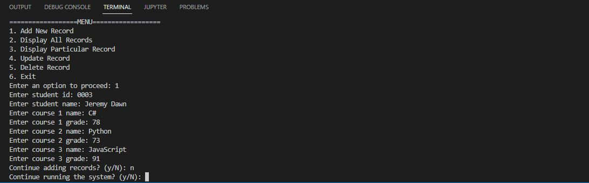
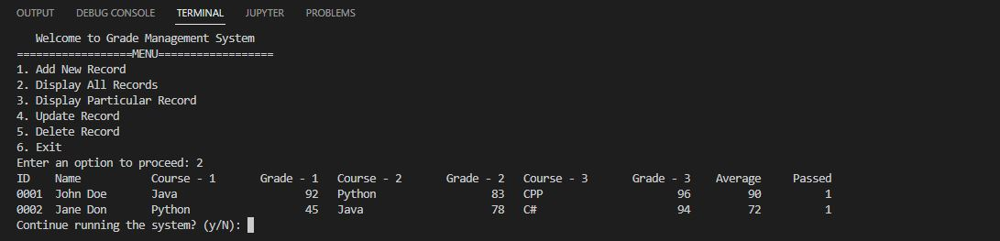
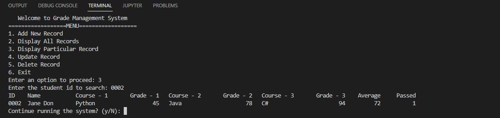
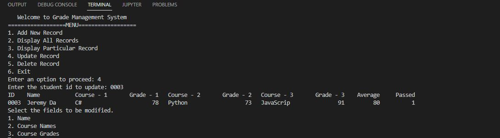
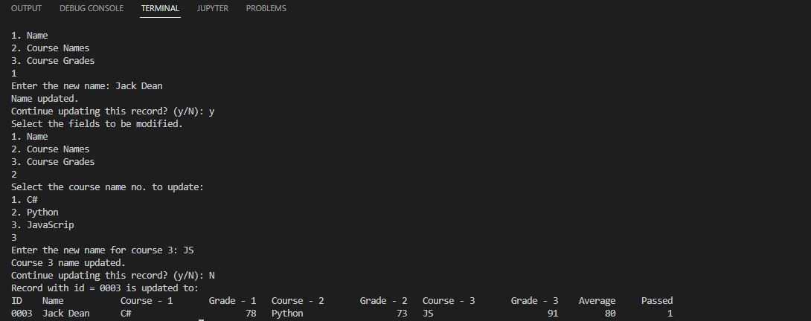
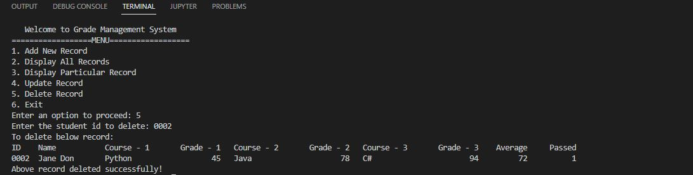
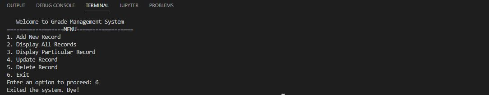

# Ex001 - Grade Management System
This project implements the CRUD of student grade. The records are stored in a .bin document by file write and read operations.

## 0. IDE
Visual Studio Code 
Mysis2

## 1. CRUD

<b>CRUD - Create</b>

<b>CRUD - Read</b>

<b>CRUD - Update</b>

<b>CRUD - Delete</b>

<b>Exit</b>

## 2. Demo
To be included.

## 3. How to run the code
Compile `main.cpp` to generate `main.exe`, run `main.exe`.