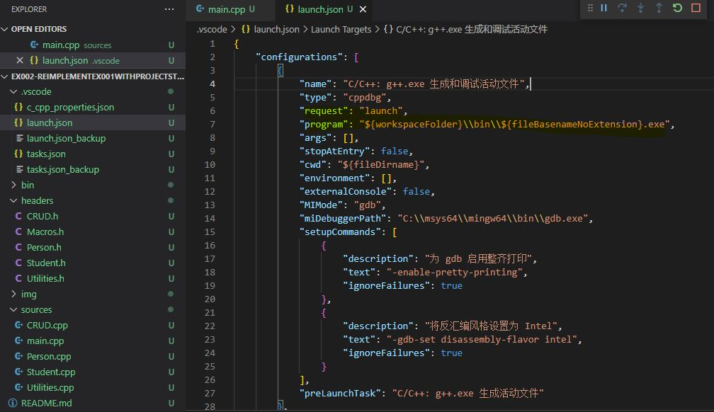
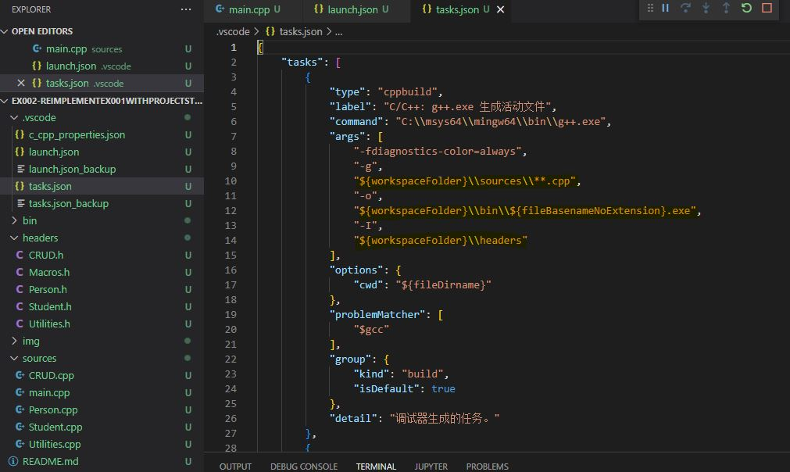
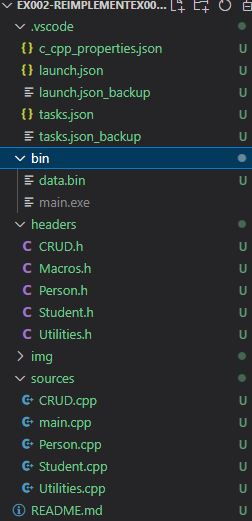
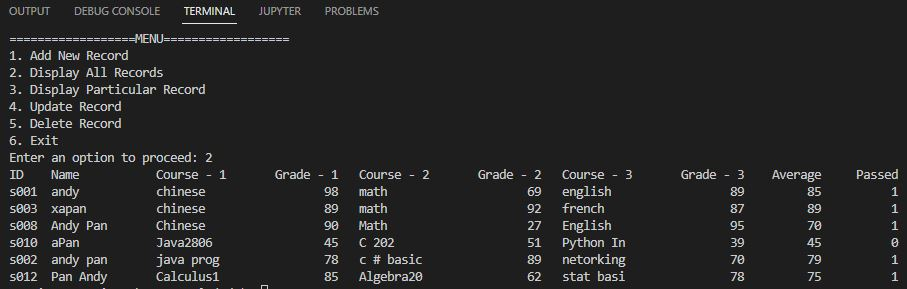

# Ex002 - Reimplement Ex001 With Project Structure
This project implements Ex001 - Grade Management System with the use of project structure. Codes are organized in separated files for better reuse.

## 0. IDE
Visual Studio Code 
Mysis2

## 1. Project

<b>Compile Configuration</b>

<b>Structure</b>

<b>Execution</b>

## 2. Demo
To be included.

## 3. How to run the code
Compile `main.cpp` to generate `main.exe`, run `main.exe`.